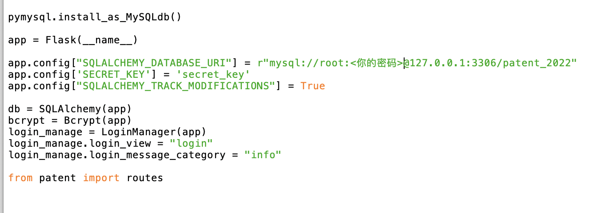

# 实验三 动态编程

## 实验目的

掌握动态Web编程框架，实现数据库在Web编程中的应用

## 实验内容及其要求

**(一)**  **实验内容**

根据小组选择的研究对象和场景（视频，专利，企业创新，其它），设计数据库应用系统，并实现动态Web编程框架（Vue+Flask-restful+Mysql）

**(二) 实验要求**

1. 定义至少三个存储过程或者函数，其中至少一个定时任务
2. 设计数据看板，并展示数据库中的数据
3. 将综合实验一和综合实验二定义的内容体现在框架上
4. 提供测试样例
5. 进阶要求：支持动态交互
6. 基于上述内容**形成课程报告。**

## 实验重点和难点

- 实验重点：Web编程、数据库应用，使用后端程序操作数据库。

- 实验难点：动态交互 

## 实验报告

```
  ____       _             _    ____  ____  _   _  ____ 
 |  _ \ __ _| |_ ___ _ __ | |_ / __ \|  _ \| | | |/ ___|
 | |_) / _` | __/ _ \ '_ \| __/ / _` | |_) | | | | |    
 |  __/ (_| | ||  __/ | | | || | (_| |  _ <| |_| | |___ 
 |_|   \__,_|\__\___|_| |_|\__\ \__,_|_| \_\\___/ \____|
                               \____/                   
```

题目：Patent@RUC

成员：梁浩贤 杜玥潼 孙代平 张云峰

实验环境：macOS Ventura 13.6.1，Mysql 8.2.0 arm64

### 安装指南

1. 通过source运行patent_2022_240106.sql文件

2. 修改__init__.py的参数，将密码字段修改为您的密码

   

3. 在终端中运行python(或python3)  <地址>/run.py 即可登陆

   

### 数据内容简介

我们选择的数据来自于PatentView数据库中2022年审批通过的专利数据，总数约18万条。通过csv文件函数进行导入，并进行了一定的数据清洗和格式化（包括但不限于缺失值处理、去重、调整国家名称等）。其中部分字段解释如下：

- IPC分类：国际专利分类（IPC），通常根据其section被分为以下八类：A- 人类生活必需品，B- 执行操作、运输，C- 化学和冶金，D- 纺织品、纸张，E- 固定建筑，F- 机械工程、照明、加热、武器，G- 物理学，H- 电学（具体信息可以查看[相关网页](https://www.j-platpat.inpit.go.jp/cache/classify/patent/PMGS_HTML/jpp/IPC/en/ipcSection/ipcSection_en.html)）
- Wipo：世界知识产权组织（World Intellectual Property Organisation），其中wipo kind指的是该专利在知识产权中的分类，详细标准参考[相关网页](https://www.wipo.int/classifications/ipc/en/)
- 专利分类Patent Type：
  - 实用新型（Utility）：这是一种专利类型，通常用于保护新的、有用的、非显而易见的技术改进或发明。实用新型专利主要关注于技术的功能性方面，而不是外观。
  - 外观设计（Design）：这是用于保护产品外观或外观设计的专利类型。它强调产品的外观、形状、装饰等方面的创新，而不是技术功能。
  - 补发（Reissue）：补发专利是指已经授予的专利，后来经审查发现有误或不完整，需要对其进行修正或补充的情况。通常，补发专利用于纠正原专利的错误或不准确的声明。
  - 植物（Plant）：在专利领域，"发明"通常指的是新的、有用的、非显而易见的技术发明。在植物领域，"发明"指的是对植物的新品种或变种的保护。这通常涉及到对植物的繁育或培育工作。

### 需求分析：

#### 专利申请者Applicant

对于申请者来说，本系统应该满足以下几个基本需求：

- 登陆账号：注册后可以用邮箱和密码登录系统
- 修改个人信息：成功登陆后可以修改个人信息，便于管理
- 浏览目前的专利信息：成功登陆后可以使用关键词、作者等信息搜索现有的专利
- 申请专利：填写专利申请，并提交
- 查看专利申请情况：查看自己账户所提交的申请（包括细节）
- 查看数据看板

#### 访客Visitor

- 登陆账号：注册后可以用邮箱和密码登录系统
- 修改个人信息：成功登陆后可以修改个人信息，便于管理
- 浏览目前的专利信息：成功登陆后可以使用关键词、作者等信息搜索现有的专利
- 查看数据看板

#### 管理员Inspector

- 登陆账号：注册后可以用邮箱和密码登录系统
- 修改个人信息：成功登陆后可以修改个人信息，便于管理
- 浏览目前的专利信息：成功登陆后可以使用关键词、作者等信息搜索现有的专利
- 查看数据看板
- 审批专利信息：查看所有申请者提交的专利申请，并审批（通过/不通过）

### 小组分工

- 专利数据查找与下载：张云峰、杜玥潼
- 专利数据清洗与导入：张云峰、梁浩贤
- 专利数据解读、触发器、追踪表设计：梁浩贤
- 数据库搭建与功能实现
  - 数据库搭建与汇总：杜玥潼
  - 基础功能实现与优化：杜玥潼、张云峰
  - 功能修改、优化（页面设置、优化搜索速度与方式、追踪表展示方式）：张云峰
  - sql代码撰写：张云峰
  - 定时器功能实现：张云峰
  - 专利数据看板设计与实现：孙代平、梁浩贤、杜玥潼
- 设置文档写作：杜玥潼、孙代平

